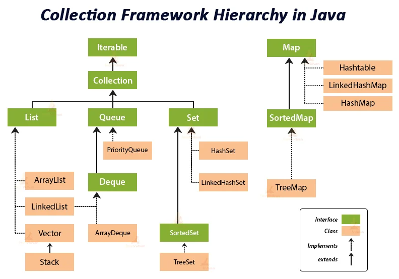

# chap12-collection


## 01. Collection Framework (컬렉션 프레임워크)

다수의 데이터를 효율적으로 관리하기 위한 표준화된 클래스 집합으로, 인터페이스를 통해 데이터 구조를 정의함

---

## ✔ 01. List (순서가 있는 저장 공간)

요소의 저장 순서를 유지하며, 중복 저장을 허용하는 데이터 구조

### 주요 구현 클래스

- ArrayList: 내부 배열을 사용하여 인덱스로 접근이 빠름 (데이터 추가/삭제가 빈번하면 성능 저하)
- LinkedList: 노드 간의 링크로 연결되어 데이터 추가/삭제가 빠름 (조회 속도는 느림)
- Stack: 후입선출(LIFO) 구조의 자료구조
- Queue: 선입선출(FIFO) 구조의 자료구조 (자바에선 LinkedList로 구현)

### 정렬 (Sorting)

- Comparable: 객체 내부의 기본 정렬 기준 정의 (`compareTo()` 오버라이딩)
- Comparator: 외부 클래스나 익명 객체로 상황에 맞는 정렬 기준 제공 (`compare()` 오버라이딩)

```java
List<String> list = new ArrayList<>();

list.add("apple");
list.add("banana");
list.add("apple"); // 중복 허용

Collections.sort(list); // 오름차순 정렬

// 람다를 활용한 사용자 정의 정렬
list.sort((a, b) -> b.compareTo(a)); // 내림차순
```

---

## ✔ 02. Set (중복을 허용하지 않는 집합)

데이터의 중복 저장을 원천적으로 방지하며, 기본적으로 순서가 없는 데이터 구조

### 주요 구현 클래스

- HashSet: 가장 빠른 성능을 가지나 순서를 보장하지 않음
- LinkedHashSet: 중복은 불허하나 저장된 순서를 유지함
- TreeSet: 이진 검색 트리 구조로 데이터가 자동으로 오름차순 정렬됨

### 데이터 순회

- Iterator: 컬렉션의 요소를 순차적으로 접근하기 위한 반복자

```java
Set<Integer> lotto = new TreeSet<>();

while (lotto.size() < 6) {
    lotto.add((int)(Math.random() * 45) + 1);
}

Iterator<Integer> iter = lotto.iterator();

while(iter.hasNext()) {
    System.out.println(iter.next());
}
```

---

## ✔ 03. Map (키와 값의 쌍)

키(Key)와 값(Value)을 하나의 쌍(Entry)으로 묶어서 관리하며, 키는 중복될 수 없음

### 주요 구현 클래스

- HashMap: 해시 알고리즘을 사용하여 빠른 검색 속도 제공
- Properties: 키와 값이 모두 문자열(String)인 특수 Map (설정 파일 로드에 주로 사용)

### Map 순회

- keySet(): 모든 키를 Set 형태로 반환
- entrySet(): 키-값 쌍(Entry) 전체를 Set 형태로 반환

```java
Map<String, String> map = new HashMap<>();

map.put("user01", "홍길동");
map.put("user01", "이순신"); // key 중복 시 value 덮어쓰기

// EntrySet 순회
for (Map.Entry<String, String> entry : map.entrySet()) {
    System.out.println(entry.getKey() + " : " + entry.getValue());
}

// Properties 활용
Properties prop = new Properties();

prop.setProperty("driver", "com.mysql.cj.jdbc.Driver");

String driver = prop.getProperty("driver");
```

---

## 👀 핵심 요약

### List

- 인덱스로 관리하며 중복 허용
- ArrayList(조회용), LinkedList(수정용)

### Set

- 중복 불허, 순서 무관
- HashSet(성능), TreeSet(정렬)
- 순회 시 Iterator 또는 Enhanced For 사용

### Map

- 키-값 쌍으로 관리, 키는 중복 불가
- HashMap(일반), Properties(환경설정)

### 정렬 기준

- Comparable: 객체의 고정된 기본 정렬 기준
- Comparator: 유연하게 변경 가능한 정렬 기준 (익명 클래스, 람다 활용)