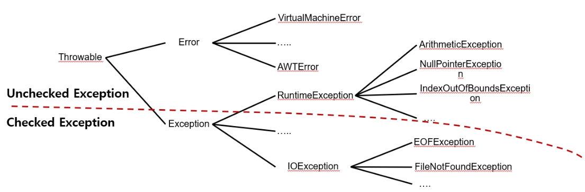

# chap13-exception

## 01. Exception (예외 처리)

프로그램 실행 시 발생할 수 있는 예기치 못한 상황(예외)을 안전하게 처리하여 프로그램의 비정상 종료를 막고, 실행 상태를 유지하는 기술


---

## ✔ 01. Exception Basic (예외 처리 기초)

예외 발생 시 프로그램의 흐름을 제어하기 위해 `try-catch`, `finally`, `throws` 키워드를 사용함

- `try-catch`
    - 예외가 발생할 가능성이 있는 코드를 `try` 블록에 넣고, 발생한 예외를 `catch` 블록에서 처리
- `finally`
    - 예외 발생 여부와 상관없이 무조건 실행되어야 하는 코드(자원 반납 등)를 작성
- `throws`
    - 발생한 예외를 직접 처리하지 않고 호출한 상위 메소드로 위임

```java
public void testMethod(int num) throws Exception {
    if(num == 0) {
        // 강제로 예외 발생
        throw new Exception("0으로 나눌 수 없습니다.");
    }
}

// 호출부에서의 처리
try {
    et.testMethod(0);
} catch (Exception e) {
    System.out.println("예외 메시지: " + e.getMessage());
} finally {
    System.out.println("프로그램을 안전하게 종료합니다.");
}
```

---

## ✔ 02. User Exception (사용자 정의 예외)

표준 API에서 제공하는 예외 클래스 외에, 비즈니스 로직에 맞는 특정 예외 상황을 정의하기 위해 직접 예외 클래스를 생성함

- `Checked Exception`
    - `Exception`을 상속받으며, 반드시 예외 처리가 강제됨
- `Unchecked Exception`
    - `RuntimeException`을 상속받으며, 명시적인 예외 처리를 선택할 수 있음

```java
// 사용자 정의 예외 클래스
public class MoneyNegativeException extends NegativeException {
    public MoneyNegativeException(String message) {
        super(message);
    }
}

// 비즈니스 로직 적용
public void checkEnoughMoney(int price, int money) throws NotEnoughMoneyException {
    if(money < price) {
        throw new NotEnoughMoneyException("잔액이 부족합니다.");
    }

    System.out.println("결제가 완료되었습니다.");
}
```

---

## ✔ 03. Exception & Inheritance (예외와 상속)

메소드를 오버라이딩할 때, 부모 메소드가 던지는 예외보다 더 상위 타입의 예외나 새로운 Checked 예외를 던질 수 없음

(Liskov Substitution Principle 준수)

- 허용 범위
    - 부모와 동일한 예외
    - 부모 예외의 자식(하위) 예외
    - 예외를 던지지 않는 경우
- 목적
    - 다형성을 활용할 때 부모 타입으로 메소드를 호출하는 곳에서 예측 가능한 범위 내의 예외만 처리하기 위함

```java
public class SuperClass {
    public void method() throws IOException {}
}

public class SubClass extends SuperClass {

    // 부모보다 하위 타입이거나 동일한 예외만 throws 가능
    @Override
    public void method() throws FileNotFoundException {}

    // Exception(상위)이나 다른 Checked 예외는 불가
    // public void method() throws Exception {} (X)
}
```

---

### 👀 핵심 요약

- 예외 처리의 목적
    - 비정상 종료 방지 및 로그 기록을 통한 유지보수성 향상
- Checked vs Unchecked
    - 외적인 요인(IO, Network)은 `Exception` 상속 (Checked)
    - 개발자의 실수(산술연산, 널포인터)는 `RuntimeException` 상속 (Unchecked)
- 사용자 정의 예외
    - 예외 클래스명만으로도 어떤 문제가 발생했는지 직관적으로 파악 가능하게 설계
- 오버라이딩 규칙
    - 자식 클래스는 부모 클래스의 예외 범위를 넘어서는 안 됨
    - 더 구체적인 예외만 가능
---
# chap14-io

## 01. IO (Input / Output)

데이터를 입력(Input)받고 출력(Output)하는 모든 활동을 의미하며, 자바에서는 스트림(Stream)이라는 개념을 통해 일관된 방식으로 입출력을 처리함

- 스트림(Stream)
  - 데이터가 이동하는 통로
  - 단방향, FIFO(First In First Out) 구조
- 분류
  - 통로의 크기
    - 바이트 스트림 (1byte)
    - 문자 스트림 (2byte)
  - 역할
    - 기본 스트림
      - 데이터 직접 입출력
    - 보조 스트림
      - 기능 향상

---

# ✔ 01. File (파일 클래스)

디스크의 파일이나 디렉토리를 제어하기 위한 클래스로, 실제 파일의 존재 여부와 상관없이 객체 생성이 가능함

- `createNewFile()`
  - 파일을 실제로 생성
- `delete()`
  - 파일 삭제
- `length()`
  - 파일 크기(byte) 확인
- `getPath()`
- `getAbsolutePath()`
  - 경로 정보 확인

```java
File file = new File("test.txt");

try {
    boolean isCreated = file.createNewFile();

    System.out.println("절대 경로: " + file.getAbsolutePath());
    System.out.println("파일 크기: " + file.length() + "byte");

} catch (IOException e) {
    e.printStackTrace();
}
```

---

# ✔ 02. Stream (기본 스트림)

데이터를 직접적으로 입출력하는 가장 기본적인 통로임

## 바이트 스트림

- `FileInputStream`
- `FileOutputStream`

특징:

- 1바이트 단위 처리
- 이미지, 동영상 등 모든 파일 처리 가능

---

## 문자 스트림

- `FileReader`
- `FileWriter`

특징:

- 2바이트(char) 단위 처리
- 텍스트 파일 처리에 특화

---

## 자원 반납 (try-with-resources)

- 스트림은 외부 자원을 사용하므로 반드시 `close()` 호출 필요
- Java 7부터 `try-with-resources` 사용 시 자동으로 자원 반납 가능

```java
// try-with-resources 예시 (자동 close)
try (FileWriter fw = new FileWriter("test.txt")) {

    fw.write("Hello World");
    fw.write(new char[]{'A', 'B', 'C'});

} catch (IOException e) {
    e.printStackTrace();
}
```

---

# ✔ 03. Filter Stream (보조 스트림)

기본 스트림에 결합하여 속도를 향상시키거나 추가 기능을 제공하는 스트림

(단독 생성 불가)

---

## 성능 향상 스트림

- `BufferedInputStream`
- `BufferedOutputStream`
- `BufferedReader`
- `BufferedWriter`

특징:

- 버퍼(임시 저장 공간)를 사용하여 입출력 횟수 감소
- 성능 향상

추가 기능:

- `BufferedReader.readLine()`
  - 텍스트를 한 줄씩 읽기 가능

```java
// BufferedReader를 이용한 줄 단위 읽기
try (BufferedReader br =
         new BufferedReader(new FileReader("test.txt"))) {

    String line;

    while ((line = br.readLine()) != null) {
        System.out.println(line);
    }

} catch (IOException e) {
    e.printStackTrace();
}
```

---

## 브릿지 스트림

- `InputStreamReader`
- `OutputStreamWriter`

특징:

- 바이트 스트림 ↔ 문자 스트림 변환 역할
- 예: `System.in` 처리 시 사용

---

## 👀핵심 요약

### 스트림 특징

- 단방향 흐름
- 사용 후 반드시 `close()` 필요

---

### 바이트 vs 문자 스트림

- 바이트 스트림
  - 모든 데이터 처리 가능
- 문자 스트림
  - 한글 등 텍스트 처리에 유리

---

### 보조 스트림 활용

- 실제 입출력은 기본 스트림이 수행
- 보조 스트림은 속도/편의성 향상을 위해 기본 스트림을 감싸서 사용

---

### 표준 입출력

- `System.in` 은 바이트 스트림
- 문자 처리 시 `InputStreamReader` 같은 브릿지 스트림 사용 권장