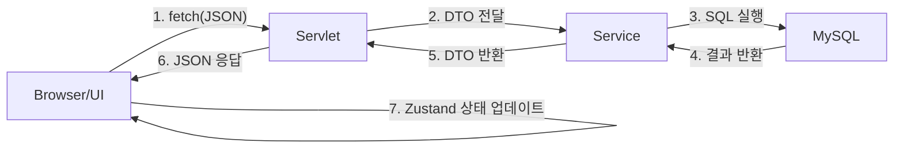

# 📌 [Servlet] chap04-state-management (Cookie & Session)

---

# 1. 상태 유지(State Management) 개요

HTTP 프로토콜은 Stateless(무상태) 특성을 가지므로, 이전 요청의 정보를 기억하지 않음. 이를 해결하기 위해 서버와 클라이언트 간의 상태를 유지하는 두 가지 핵심 기술을 사용

---

# 2. Cookie vs Session 비교

| 구분 | 쿠키 (Cookie) | 세션 (Session) |
| --- | --- | --- |
| 저장 위치 | 클라이언트 (브라우저) | 서버 (WAS 메모리) |
| 보안성 | 낮음 (사용자가 수정 가능) | 높음 (서버에서 관리) |
| 데이터 형식 | String (문자열만 가능) | Object (모든 자바 객체) |
| 만료 시점 | 설정한 만료 시간까지 유지 | 브라우저 종료 또는 세션 타임아웃 |
| 주요 용도 | 아이디 저장, 오늘 하루 보지 않기 등 | 로그인 정보, 장바구니 등 보안 필요 데이터 |

---

# 3. 핵심 기술 활용 (Java Servlet)

## 🍪 쿠키 사용법 (Cookie)

브라우저에 저장되며, 이후 요청마다 자동으로 서버에 전송

```java
// 1. 쿠키 생성
Cookie cookie = new Cookie("rememberId", "user01");

// 2. 쿠키 설정 (옵션)
cookie.setMaxAge(60 * 60 * 24); // 24시간 유지
cookie.setPath("/");             // 모든 경로에서 전송
cookie.setHttpOnly(true);        // JS에서 접근 차단 (보안)

// 3. 응답에 포함
resp.addCookie(cookie);
```

## 🔐 세션 사용법 (HttpSession)

서버에 저장되며, 브라우저에는 JSESSIONID라는 식별자 쿠키만 전달

```java
// 1. 세션 가져오기 (없으면 생성)
HttpSession session = req.getSession();

// 2. 세션 데이터 저장
session.setAttribute("loginUser", "user01");

// 3. 세션 만료 시간 설정
session.setMaxInactiveInterval(60 * 30); // 30분

// 4. 세션 무효화 (로그아웃 시)
session.invalidate();
```

---

# 💻 Auth API 실습 (Login / Logout / Me)

---

## 1) Backend: AuthApiServlet.java (JSON API)

서블릿 하나에서 여러 경로(/api/auth/*)를 처리하며 JSON 데이터를 주고받음.

```java
@WebServlet(urlPatterns = {"/api/auth/login", "/api/auth/me", "/api/auth/logout"})
public class AuthApiServlet extends HttpServlet {
    private final ObjectMapper mapper = new ObjectMapper();

    // POST: Login / Logout 처리
    protected void doPost(HttpServletRequest req, HttpServletResponse resp) throws IOException {
        String path = req.getServletPath();

        if ("/api/auth/login".equals(path)) {

            // 1. 역직렬화 (JSON -> DTO)
            LoginRequest reqBody = mapper.readValue(req.getReader(), LoginRequest.class);

            // 2. 인증 로직 (세션 생성)
            HttpSession session = req.getSession();
            session.setAttribute("loginUser", reqBody.getId());

            // 3. 직렬화 (DTO -> JSON) 응답
            mapper.writeValue(resp.getWriter(), new AuthResponse(true, reqBody.getId()));
        }
    }

    // GET: 현재 로그인 정보 확인 (/api/auth/me)
    protected void doGet(HttpServletRequest req, HttpServletResponse resp) throws IOException {

        HttpSession session = req.getSession(false); // 기존 세션 확인

        String user = (session != null)
                ? (String) session.getAttribute("loginUser")
                : null;

        if (user == null) {

            resp.setStatus(HttpServletResponse.SC_UNAUTHORIZED); // 401
            mapper.writeValue(resp.getWriter(), new AuthResponse(false, null));

        } else {

            mapper.writeValue(resp.getWriter(), new AuthResponse(true, user));
        }
    }
}
```

---

## 2) Frontend: 비동기 통신 (fetch API)

```jsx
// 로그인 호출
async function login(id, password) {

    const response = await fetch('/api/auth/login', {
        method: 'POST',
        headers: { 'Content-Type': 'application/json' },
        body: JSON.stringify({ id, password })
    });

    return response.json();
}

// 현재 사용자 확인
async function getMe() {

    const response = await fetch('/api/auth/me');

    if (response.status === 401) {
        return null;
    }

    return response.json();
}
```

---

## 🔄 데이터 흐름 요약

| 단계 | 동작 | 상세 내용 |
| --- | --- | --- |
| 1 | 로그인 요청 | 클라이언트가 ID/PW를 JSON으로 전송 (POST) |
| 2 | 세션 생성 | 서버가 인증 성공 시 HttpSession 생성 및 데이터 저장 |
| 3 | 식별자 전달 | 서버 응답 헤더에 Set-Cookie: JSESSIONID=... 포함 |
| 4 | 상태 유지 | 이후 클라이언트의 모든 요청에 JSESSIONID 쿠키 자동 포함 |
| 5 | 사용자 확인 | 서버는 전달받은 JSESSIONID로 메모리에서 세션 객체 매핑 |
| 6 | 로그아웃 | session.invalidate()로 서버 메모리 데이터 삭제 |

---

## 📝 핵심 정리

| 기술 | 역할 |
| --- | --- |
| Stateless | HTTP의 기본 특성 (상태 정보 없음) |
| Cookie | 클라이언트에 저장되는 키-값 쌍 데이터 |
| Session | 서버 메모리에 저장되는 사용자별 고유 공간 |
| JSESSIONID | 세션과 브라우저를 연결하는 유일한 열쇠(쿠키) |
| JSON API | CSR(Client Side Rendering) 환경에서 세션 기반 인증 구현의 표준 |

---

# 📌 [Servlet & Full-Stack] 핵심 기술 및 계층형 아키텍처

---

# 1. Servlet & 웹 통신 기초

서블릿은 WAS(Tomcat 등)에서 동작하는 자바 기반 서버 사이드 프로그램.

| 단계 | 주요 내용 | 핵심 특징 |
| --- | --- | --- |
| 생명주기 | init() → service() → destroy() | 컨테이너가 관리, 싱글톤처럼 동작 |
| 객체 | HttpServletRequest / HttpServletResponse | 요청 정보 추출 및 응답 데이터(JSON 등) 처리 |
| 이동 방식 | Forward(서버 내부 이동, URL 유지) | Redirect(클라이언트 재요청, URL 변경) |

---

# 2. JSON 데이터 처리 (Jackson Library)

현대적인 웹 애플리케이션에서 서버와 클라이언트 간의 데이터 교환 표준

- ObjectMapper: Jackson 라이브러리의 핵심 클래스로 직렬화/역직렬화 수행
- 직렬화 (Serialization): Java 객체 ➔ JSON 문자열 (mapper.writeValue())
- 역직렬화 (Deserialization): JSON 문자열 ➔ Java 객체 (mapper.readValue())
- 주의사항: DTO 작성 시 기본 생성자가 반드시 포함되어야 함

---

# 3. Backend: 3계층 아키텍처 (3-Tier)

관심사를 분리하여 유지보수성을 높이는 구조

| 계층 (Layer) | 클래스 예시 | 주요 역할 |
| --- | --- | --- |
| Controller | MemoApiServlet | HTTP 요청 수신, JSON 파싱, 응답 반환 |
| Service | MemoService | 비즈니스 로직, DB Connection 관리, 트랜잭션 처리 |
| Repository | MemoDAO | SQL 실행, Generated Keys(PK) 조회, ResultSet 매핑 |

---

# 4. Frontend: Next.js + Zustand

비동기 통신과 전역 상태 관리를 통해 사용자 경험(UX)을 향상

## 🔄 프론트엔드 통신 및 상태 관리 흐름

1. API Layer (fetch): fetch('/api/memos')를 통해 백엔드 서블릿과 통신 (JSON 송수신)
2. State Layer (Zustand): 서버에서 받은 데이터를 전역 상태(memos)에 저장
3. UI Layer (React): 상태가 변경되면 화면이 새로고침 없이 자동으로 리렌더링

---

## 🏗 Full-Stack 전체 데이터 흐름 (Data Flow)



---

## 💡 핵심 요약 및 실무 포인트

| 항목 | 핵심 내용 |
| --- | --- |
| 통신 프로토콜 | REST API 기반의 비동기 JSON 통신 (application/json) |
| 영속성(Persistence) | JDBC를 활용하여 서버 종료 후에도 데이터가 DB에 안전하게 보관됨 |
| 생성된 키 처리 | RETURN_GENERATED_KEYS를 사용하여 INSERT 직후 PK를 즉시 반환받음 |
| 관심사 분리 | 프론트(UI/상태)와 백엔드(로직/DB)를 독립적으로 개발 및 확장 |